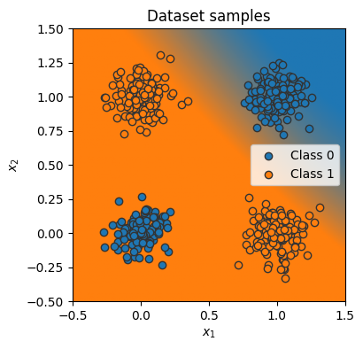
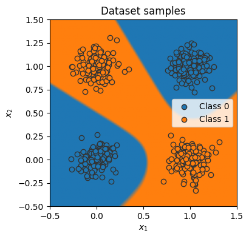

# 🚀 Neural Network From Scratch in Python

This repository contains the full implementation of a **simple neural network built from scratch** in Python, as demonstrated in my [Medium article](<Article Link>).

---

## 📖 Overview

In this project, we build a **fully connected neural network** from scratch without using deep learning libraries like PyTorch or TensorFlow. The implementation includes:

- **Forward Propagation**
- **Backpropagation**
- **Training with Gradient Descent**
- **Evaluation & Accuracy Calculation**

The code is designed to be simple and educational, demonstrating the core concepts of neural networks. Perfect for beginners who want to understand how neural networks work under the hood!

---

## 📂 Files

- `simple_nn.py` — Implementation of the neural network.
- `train.py` — Training script with evaluation functions.
- `dataset.py` — Helper functions for data processing and evaluation.
---

## 💡 Getting Started

### Requirements
- Python 3.x
- NumPy

Install dependencies:
```bash
pip install numpy
```
## Usage:

```python
%matplotlib inline
from dataset import visualize_classification, XORDataset
import matplotlib.pyplot as plt
from simple_nn import SimpleClassifier, GradientDescent
from train_nn import train_model, eval_model, create_data_loader
```


```python

num_inputs = 2
num_hidden = 4
num_outputs = 1

train_dataset = XORDataset(size=2500)
test_dataset = XORDataset(size=500)

train_data_loader = create_data_loader(train_dataset)
test_data_loader = create_data_loader(test_dataset)


model = SimpleClassifier(num_inputs, num_hidden, num_outputs)
optimizer = GradientDescent(lr=0.01)
```


```python
_ = visualize_classification(model, test_dataset.data, test_dataset.label)
```


    

    


```python
train_model(model, train_data_loader, optimizer)
eval_model(model, test_data_loader)
_ = visualize_classification(model, test_dataset.data, test_dataset.label)
```

    Model Accuracy: 100.00%


    

    

